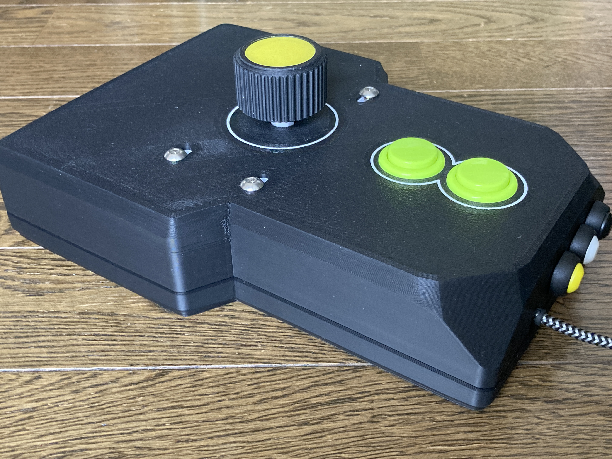
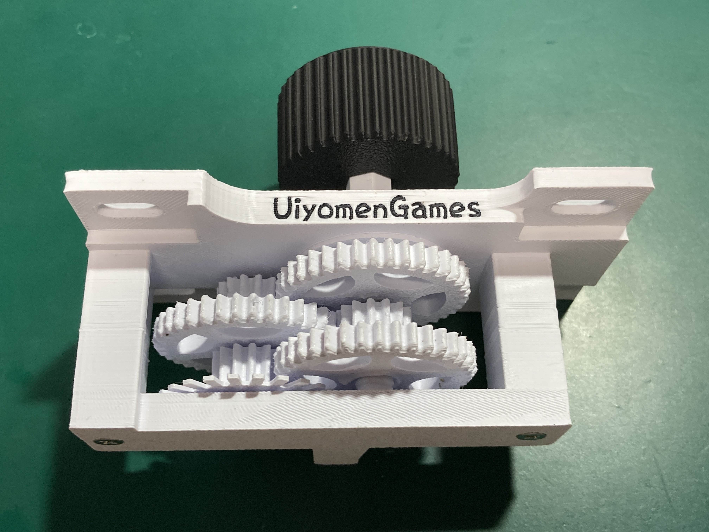
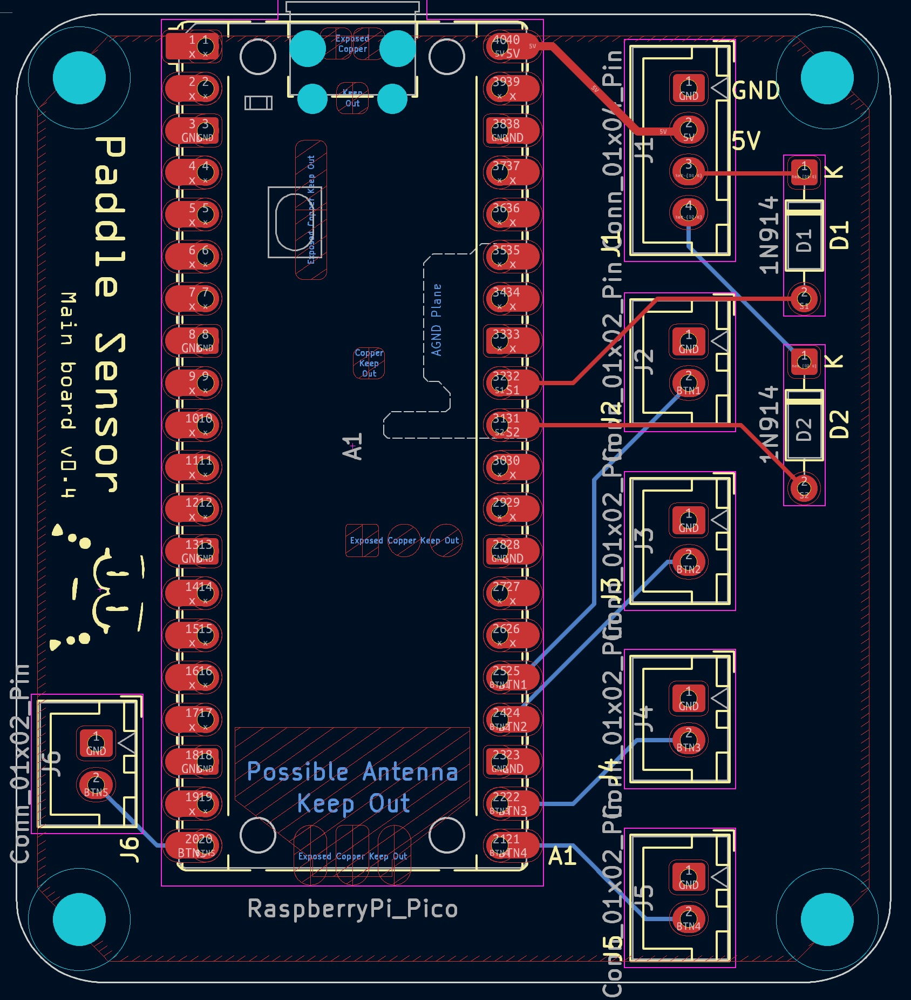
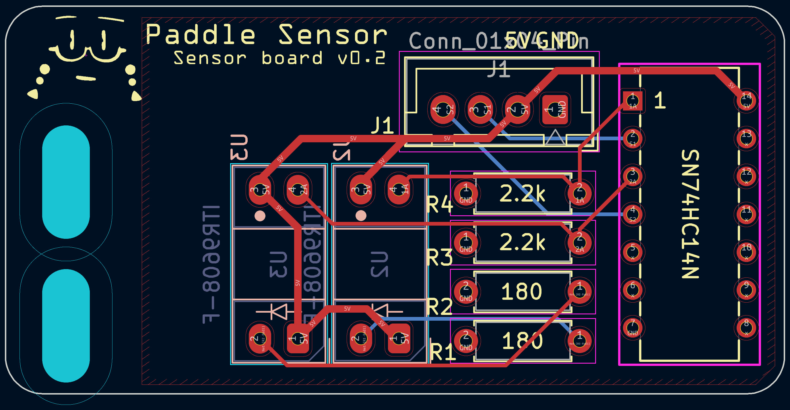
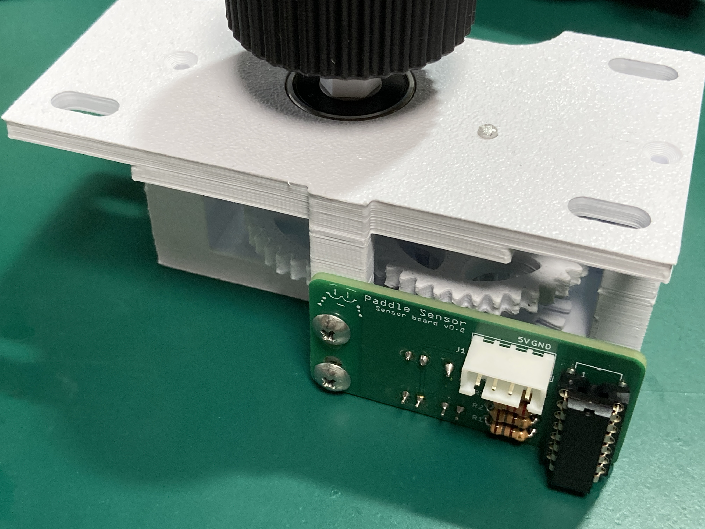
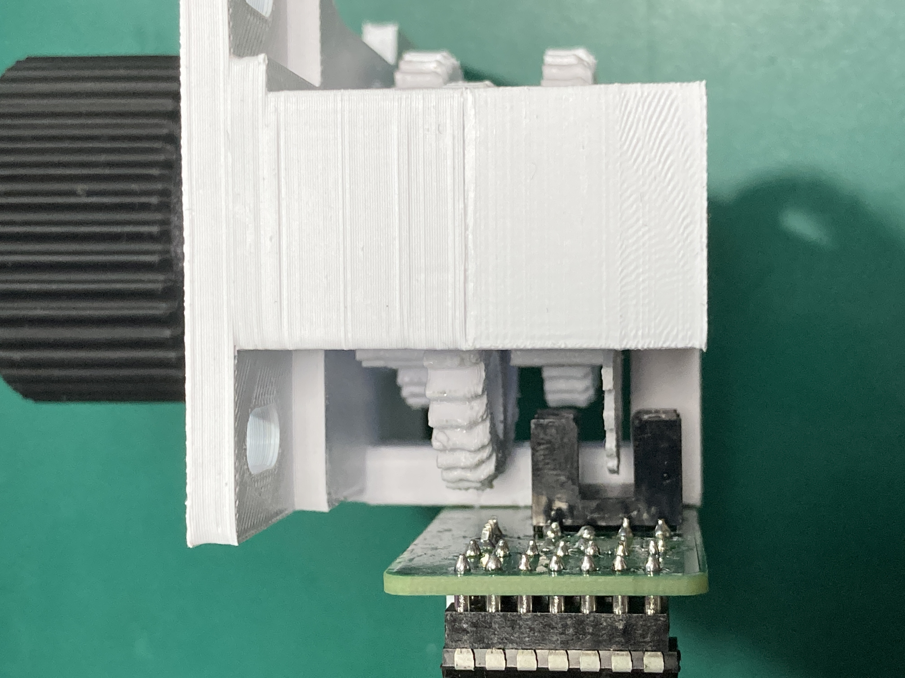
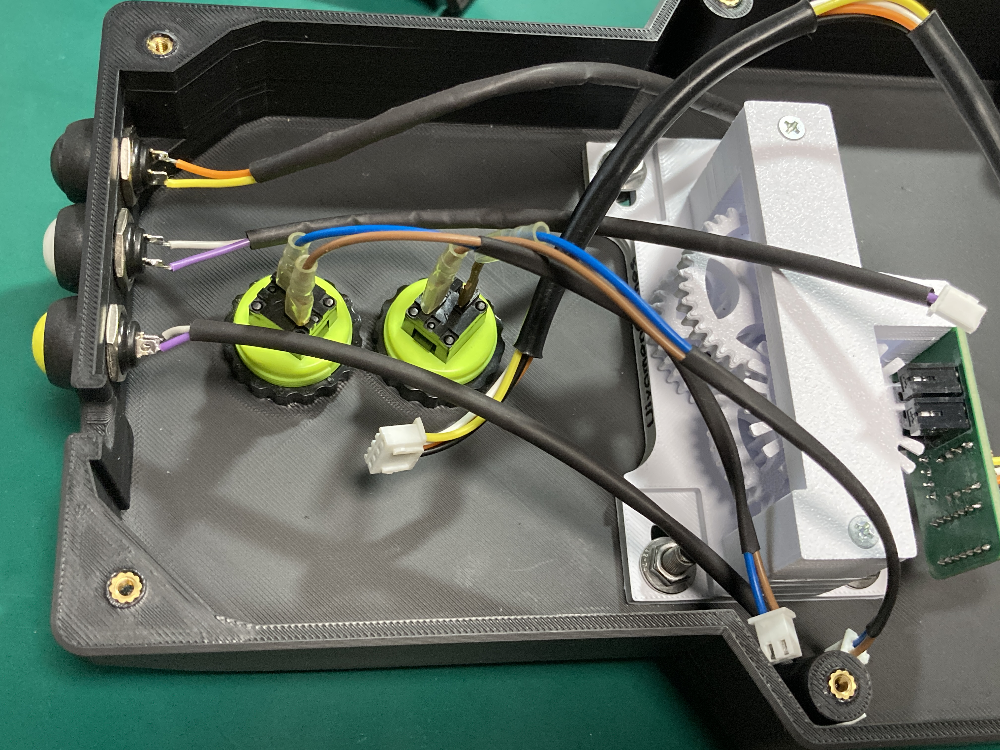
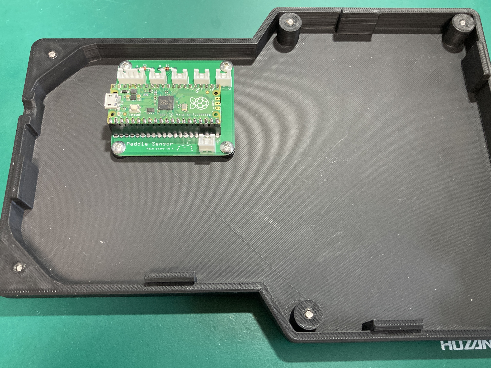
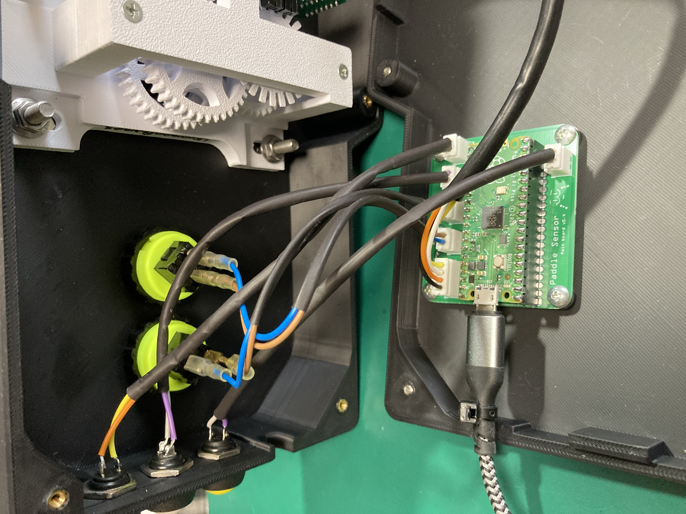

 
 

# USBPaddleController

raspberrypi picoを使用したUSBパドルコントローラです 
USBマウスとして動作しますので、それらの入力を受け付けるソフトであれば大抵動くんじゃないかと思います *(USBゲームパッドモードも追加しました)* 
X/Y軸の切り替えと速度変更にも対応しています 

### パドル本体について
パドルユニット部は、ういよめん氏作のパドルコントローラを使用します 
https://www.thingiverse.com/thing:5404242
 
ういよめん氏のBOOTHで購入する、自分で3Dプリントする等の手段で別途ご用意ください 
https://uiyomengames.booth.pm/items/3914858
 
当方未確認ですが、ういよめん氏のパドルコントローラのネジ位置はアーケード版アルカノイド用のパドルと寸法が合わせてあるそうなので、そちらも使えるかもしれません 

### パドル以外のハードウェア
hardwareフォルダにはパドルユニットに組み付けるセンサー基板とpicoを載せるメイン基板の回路図とガーバーを入れておきました 
ガーバーのzipファイルをそのままJLCPCBに送ることで基板を発注できます(たぶん数百円) 
組立時の注意としては、センサー基板は位置がずれると正常に動きを検知できなくなるようです 
パドルユニットの「ギア4」の中心が二つのセンサーの中心付近にくるようにしてください 

### 使用部品
| 部品 | 型番 | 個数 | 備考 |
| --- | --- | --- | --- |
| マイコン | RaspberryPi pico | 1 | メイン基板 |
| ダイオード | 1SS178 | 2 | メイン基板 D1,D2 |
| インバータ | 74HC14 (U74HC14L-D14-T) | 1 | センサー基板 |
| 透過型フォトインタラプタ | SG206 | 2 | センサー基板 U2,U3 他のパーツの裏側に付きます |
| カーボン抵抗 | 180Ω | 2 | センサー基板 R1,R2 |
| カーボン抵抗 | 2.2kΩ | 2 | センサー基板 R3,R4 |
| XHコネクタ ベース付ポスト トップ型 2P | B2B-XH-A(LF)(SN) | 5 | メイン基板J2-J6 |
| XHコネクタ ベース付ポスト トップ型 4P | B4B-XH-A(LF)(SN) | 2 | メイン基板J1 / センサー基板J1|
| XHコネクタ ハウジング 2P | XHP-2 | 5 | |
| XHコネクタ ハウジング 4P | XHP-4 | 2 | |
| XHコネクター ハウジング用コンタクト | SXH-001T-P0.6 | 18 |  |
| 24φネジ式押しボタン | PS-14-DN | 2 | ご自身でケースを用意される場合はお好みで |
| ネジ径12Φ押しボタン |  | 3 | ご自身でケースを用意される場合はお好みで |
| M3 インサートナット |  | 6 | ケース(大)の場合、ケース組立に使用 ケース上パーツの穴に入れる |
| M3 5mm ビス |  | 4 | ケース(大)の場合、ケース組立に使用 |
| M5 ナット |  | 4 | パドルユニットをケースに組み付けるのに使用 |
| M5 15mm ビス |  | 4 | パドルユニットをケースに組み付けるのに使用 長さはお好みで |
| M3 6mm タッピングビス |  | 6 | ケースにメイン基板を固定するのに4個 パドルユニットにセンサー基板を固定するのに2個 ケース(小)の場合はケース組立のために+4個 |

### スイッチとコネクタの対応
| コネクタ# | スイッチ# | 機能 |
| --- | --- | --- |
| J2 | SW1 | 左ボタン |
| J3 | SW2 | 右ボタン |
| J4 | SW3 | 速度切り替えボタン |
| J5 | SW4 | X/Y軸切り替えボタン |
| J6 | SW5 | センターボタン |

### ファームウェアの書込み
picoのBOOTSELを押しながらUSBケーブルを接続するとエクスプローラーが起ち上がり、picoのフォルダが表示されます(winの場合） 
そこにfirmware.uf2をコピーしてください 
ファームウェアの更新が完了するとpicoが再起動します 

### 速度切り替えボタン
SW3は速度切り替えボタンです 
パドルの反応速度を4段階で切り替えることが可能です 
押下するごとに高速から順に低速に切り替わり、最低速の次は高速に戻ります 

### X/Y軸切り替えボタン
SW4はX/Y軸切り替えボタンです 
押下するごとにマウスの移動方向が切り替わります 
X軸移動のみでは「メタルオレンジEX」のメニュー操作ができなかったので追加しました 
*軸切り替えボタンと右または左ボタン同時押しのセンタークリックは廃止しました* 

### 連射モード
**速度切替ボタンを押しながら**左右センターいずれかのボタンを押すと連射モードのON/OFF切り替えが行われます 
連射モードONになっているボタンを押下している間、連射します 
連射速度は秒間10発程度の固定です 

---

### ゲームパッドモード(ポールポジションモード)
**X/Y軸切り替えボタン**と**速度切り替えボタン**を同時押しすると、USBマウスモードとUSBゲームパッドモードが交互に切り替わります 
USBゲームパットモードではボタンの機能が以下のようになります 

| マウス操作 | パッド操作 |
| --- | --- |
| 回転 | 左スティック |
| 左 | R2 3秒以上長押しした後に離すと、L2が自動で0.9秒間連打されます(オートブレーキ) L2連打中に再度ボタン押下で連打がキャンセルされます |
| 右 | ×/□のトグル動作 |
| センター | △ |
| 速度切り替え | PS |

速度切り替え/連射は無効化されます 
その他のボタン機能はUSBマウスモードと同様に機能します 
PS5との接続はFGC2を介してどうにかなるかもしれません 

---

### 設定の保存
マウス/ゲームパッドのモードと各設定値は設定変更のタイミングで保存され、再起動時は設定内容を復元します 
設定値はマウス/ゲームパッドのモード毎に保存されます 
 
 

---

### ケースについて
パドルコントローラのケースはサイズ違いのものを用意しました 
小さい方は20cmX20cmのヒートベッドで出力可能ですが、2ボタン仕様であり手の置き場もないため若干操作しづらくなっています 
大きい方はケースの締め付けにインサートナットを使用しますので別途ご用意ください 
自作されたり、アーケード機のコントロールボックス等に入れるのも良いと思います 
 

---

### 組み立て手順
#### パドルユニットの作成
 
 

- 公開されているデータをもとに3Dプリント等を行ってください 
 

***
#### 基板の作成
 
 
 

- 基板イメージと使用部品表を参考に部品を半田付けしてください 
- メイン基板のRaspberryPi picoの取り付けはピンソケットを使用することを前提としています 
- センサー基板のフォトインタラプタはその他の部品の裏側の面に実装します 
 

***
#### パドルユニットにセンサー基板を取り付け

 
 

- パドルユニットにセンサー基板を取り付けます 
- フォトインタラプタとパドルユニットの円盤が接触しないようにしてください 
 

***
#### ケース(上)にパドルユニットとスイッチを取り付け
 
 

- ケース(上)にはあらかじめインサートナットを入れておいてください 
- ケース(上)にパドルユニットとボタンを取り付けます 

***
#### ケース(下)にメイン基板を取り付け
 
 

- ケース(下)にメイン基板を取り付けます 

***
#### メイン基板と接続
 
 

- メイン基板とセンサー基板、各スイッチを接続します 
- スイッチ類はすべて同じコネクタ形状ですので、配置はお好みで組み替えてください 

***
#### 完成
 
 

- ケースを閉じて完成です　お疲れさまでした 
 
 

---
### テスト環境
以下のテスト環境で動作確認を行っています 
- X68000 Z 
- PlayStation 5 (ゲームパッドモードはBrook FGC2を使用) 
- Windows11 
 

---

### 参考サイト
- ういよめん氏　Arkanoid Paddle (spinner) controller Rotary encoder 
https://www.thingiverse.com/thing:5404242

- わいくん氏　ゲーム基板用センサー図鑑 
https://www.ykuns-mechanical-club.com/game%20sensor.html
